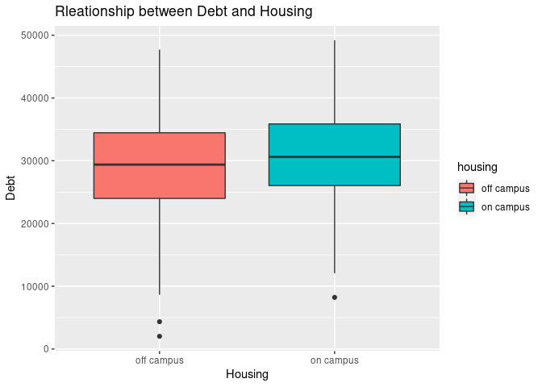
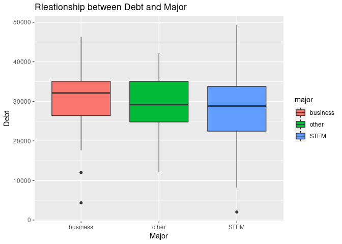
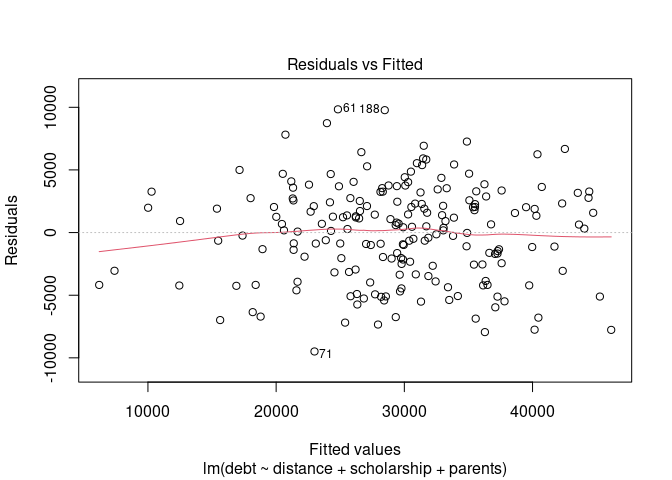
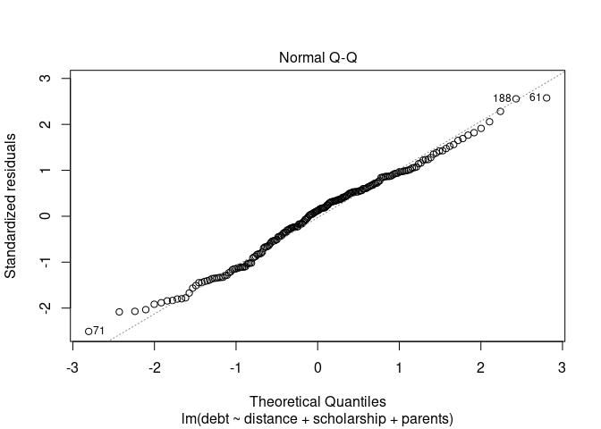
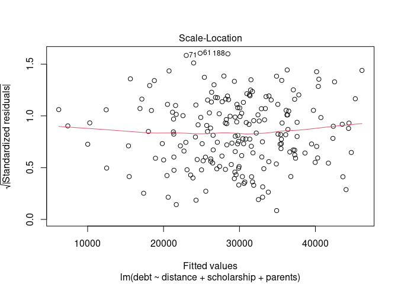
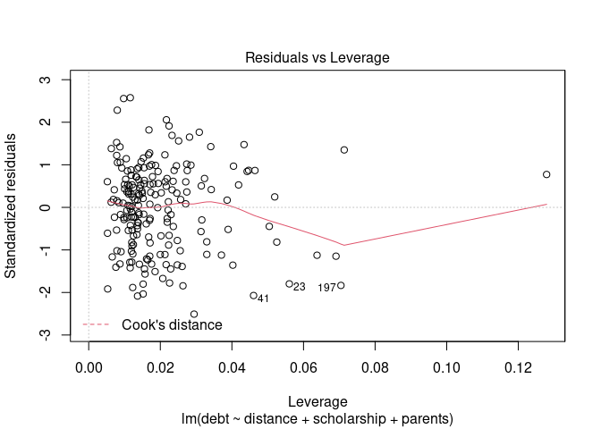
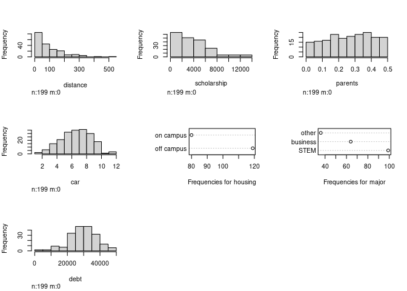
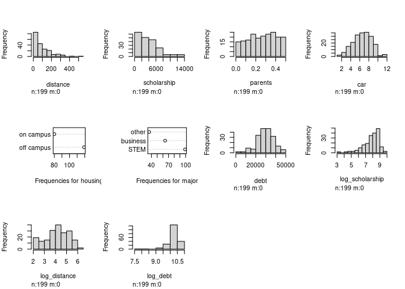

Activity 5 - Mini-competition Explorations
================

``` r
suppressPackageStartupMessages(library(tidyverse))
suppressPackageStartupMessages(library(tidymodels))
suppressPackageStartupMessages(library(GGally))
suppressPackageStartupMessages(library(ggfortify))
library(readr)
library(skimr)
library(broom)
library(psych)
suppressPackageStartupMessages(library(Hmisc))
```

``` r
# Loading data using read_csv() function

students<-read_csv("~/STA631/Activities/activity-05-mini-competition/competition-files/data/allendale-students.csv",show_col_types = FALSE)

# Checking the distribution of variables using hist.data.frame() function from Hmisc package

hist.data.frame(students)
```

<!-- --> \*
From the above histogram we can observe that distance and scholarship
variables are right skewed

``` r
# Using the describe function from Psych package to check the normality of variables by using skewness and kurtosis values

psych::describe(students)
```

    ##             vars   n     mean      sd   median  trimmed     mad  min     max
    ## distance       1 200    96.55   89.45    70.00    82.12   74.13    0   530.0
    ## scholarship    2 200  3899.07 3396.34  3202.50  3447.75 3065.28   25 26574.0
    ## parents        3 200     0.27    0.14     0.28     0.27    0.16    0     0.5
    ## car            4 200     7.08    2.03     7.00     7.12    1.48    1    12.0
    ## housing*       5 200     1.40    0.49     1.00     1.38    0.00    1     2.0
    ## major*         6 200     2.18    0.89     2.50     2.22    0.74    1     3.0
    ## debt           7 200 29472.72 8484.97 29827.00 29774.88 7968.23 2019 49196.0
    ##               range  skew kurtosis     se
    ## distance      530.0  1.56     2.89   6.32
    ## scholarship 26549.0  2.14     9.25 240.16
    ## parents         0.5 -0.14    -1.13   0.01
    ## car            11.0 -0.19    -0.26   0.14
    ## housing*        1.0  0.41    -1.84   0.03
    ## major*          2.0 -0.36    -1.65   0.06
    ## debt        47177.0 -0.36     0.31 599.98

-   Even from the above describe() function from psych package we can
    see the kurtosis values for scholarship is are more than absolute
    value of 3 and distance is almost 3 which tells that the data is
    heavily tailed.

``` r
ggpairs(students)
```

<!-- -->

``` r
plot1<-students%>%ggplot(aes(x=housing,y=debt,fill=housing))+
  geom_boxplot()+
  labs(title = "Rleationship between Debt and Housing",
       x="Housing",
       y="Debt")

plot1
```

<!-- -->

``` r
plot2<-students%>%ggplot(aes(x=major,y=debt,fill=major))+
  geom_boxplot()+
  labs(title = "Rleationship between Debt and Major",
       x="Major",
       y="Debt")

plot2
```

<!-- -->

-   By looking at the correlations between variables, we can see that
    distance, scholarship and parents have a correlation with debt. I
    have also checked the relationships between the categorical
    variables like housing and major with debt, but it was not so
    convincing to include in the model. So, I have decided to build a
    model with distance, scholarship and parents.

``` r
Model1<- lm(debt~distance+scholarship+parents,data=students)
summary(Model1)
```

    ## 
    ## Call:
    ## lm(formula = debt ~ distance + scholarship + parents, data = students)
    ## 
    ## Residuals:
    ##      Min       1Q   Median       3Q      Max 
    ## -11284.8  -2774.3    263.9   2575.6  24069.8 
    ## 
    ## Coefficients:
    ##               Estimate Std. Error t value Pr(>|t|)    
    ## (Intercept)  3.751e+04  8.522e+02   44.02   <2e-16 ***
    ## distance     4.048e+01  3.429e+00   11.81   <2e-16 ***
    ## scholarship -1.544e+00  9.014e-02  -17.13   <2e-16 ***
    ## parents     -2.222e+04  2.201e+03  -10.09   <2e-16 ***
    ## ---
    ## Signif. codes:  0 '***' 0.001 '**' 0.01 '*' 0.05 '.' 0.1 ' ' 1
    ## 
    ## Residual standard error: 4304 on 196 degrees of freedom
    ## Multiple R-squared:  0.7466, Adjusted R-squared:  0.7427 
    ## F-statistic: 192.5 on 3 and 196 DF,  p-value: < 2.2e-16

``` r
plot(Model1)
```

<!-- --><!-- --><!-- --><!-- -->

-   After building the model and checking the residual plots, I have
    observed that the observation 11 is a possible outlier with high
    leverage that can affect the model, so I have deleted that
    observation and built the model again.

-   I have used the augment function below from brrom package to check
    the std.residual values to identify any potential outliers that can
    effect the model (any std.residual value &gt; 3 will be a potential
    outlier)

``` r
check<-broom::augment(Model1,data=students)
```

-   Looks like there is one potential outlier in this model that is
    affecting the model which is obseravtion “11”. We can observe that
    in the plots of the model and also the augument data frame “check”.
    so, let’s go ahead and delete the observation and see how the model
    perform

``` r
students1<-students[-11,]
Main_model<- lm(debt~distance+scholarship+parents,data=students1)
summary(Main_model)
```

    ## 
    ## Call:
    ## lm(formula = debt ~ distance + scholarship + parents, data = students1)
    ## 
    ## Residuals:
    ##     Min      1Q  Median      3Q     Max 
    ## -9490.3 -2801.4   461.3  2569.1  9835.7 
    ## 
    ## Coefficients:
    ##               Estimate Std. Error t value Pr(>|t|)    
    ## (Intercept)  3.883e+04  7.823e+02   49.63   <2e-16 ***
    ## distance     4.057e+01  3.059e+00   13.26   <2e-16 ***
    ## scholarship -1.855e+00  9.140e-02  -20.30   <2e-16 ***
    ## parents     -2.324e+04  1.969e+03  -11.80   <2e-16 ***
    ## ---
    ## Signif. codes:  0 '***' 0.001 '**' 0.01 '*' 0.05 '.' 0.1 ' ' 1
    ## 
    ## Residual standard error: 3840 on 195 degrees of freedom
    ## Multiple R-squared:  0.7959, Adjusted R-squared:  0.7927 
    ## F-statistic: 253.4 on 3 and 195 DF,  p-value: < 2.2e-16

``` r
plot(Main_model)
```

<!-- --><!-- --><!-- --><!-- -->

``` r
hist.data.frame(students1)
```

<!-- -->

``` r
# Since the variables distance, scholarship and debt looks skewed , lets try to use the log transformation for these variables to see if there is any difference in the model fit.

# Tranforming the data using log transformation method and adding to a new data frame students2

students2<- students1 %>%
  mutate(log_scholarship=log(scholarship),log_distance=log(distance),log_debt=log(debt))

hist.data.frame(students2)
```

<!-- -->

``` r
students2[students2=="-Inf"]<-0
```

-   I have made various models trying different transformed variables,
    we can check the model fit using the summary function on that model.

``` r
Model2<-lm(debt~log_distance+scholarship+parents,data = students2)
Model3<-lm(debt~log_distance+log_scholarship+parents,data = students2)
Model4<-lm(log_debt~log_distance+log_scholarship+parents,data = students2)
Model5<-lm(log_debt~distance+log_scholarship+parents,data = students2)
```

## Overall, I beleive Model2 was doing better to predict or explain the variation in debt with the help of distance, scholarship and parents when deleted the observation “11” from the original dataset. The r-squared value and F-statistic value of the model is better when compared to other model. So, I have decided to go with this model as my final model.

## Assumptions of the model

-   Linearity - Looks like the model has met the assumption of linearity
    fairly
-   Constant variance - This assumption was also fairly met as the
    residuals almost spread equally along the line without any pattern
-   Normality - Fairly met except for a couple at the tail
    \*Independence of residuals - We can see there are no influential
    observation that can affect other observations and the model.
